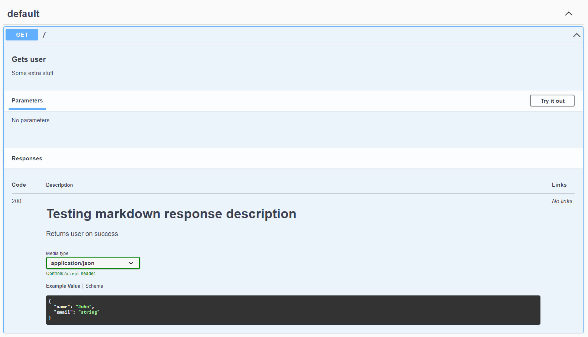
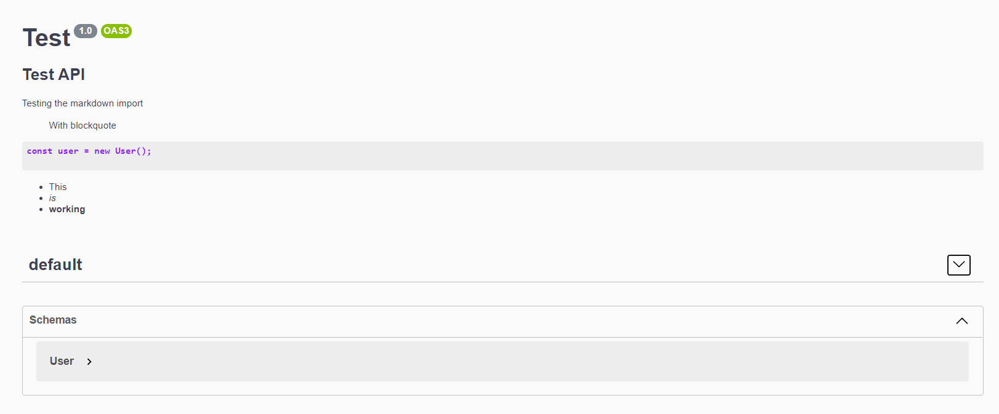

# OpenAPI

> Some of this is out-of-date / legacy from the projects being part of single monorepo

We are generating OpenAPI specification for all of our NestJS projects. To generate this specification we're using [@nestjs/swagger](https://docs.nestjs.com/openapi/introduction) package.

## Decorators and introspection

We're using typescript plugin for introspecting comments that we don't need to write decorators for classes and descriptions for methods. This allows for using same documentation for OpenAPI and jsdoc for IDE like VSCode.

This extension needs to be included in project.json:

```json
{
  ...
  "build": {
    "executor": "@nrwl/node:build",
    "outputs": ["{options.outputPath}"],
    "options": {
      ...
      "tsPlugins": [
        {
          "name": "@nestjs/swagger/plugin",
          "options": {
            "introspectComments": true
          }
        }
      ]
    }
  }
}
```

### DTOs/Entities

Interpolation happens in _\*.dto.ts_ and _\*.entity.ts_ (basic difference is dto is only for transfers, entity can be used internally, but it depends on internal standards).

Every file with this name should contain a default exported Class. The properties of this class will be automatically included in OpenAPI specs even without decorators.

To add description and example, we can use jsdoc spec instead of decorators (description can contain markdown - see next chapter).

> #### _**user.dto.ts**_
>
> ```ts
> export class User {
>   /**
>    * Name of user
>    * @example John
>    */
>   name: string;
>   email: string;
> }
> ```
>
> generates:
>
> ```yaml
> schemas:
>   User:
>     type: object
>     properties:
>       name:
>         type: string
>         description: Name of user
>         example: John
>       email:
>         type: string
>     required:
>       - name
>       - email
> ```
>
> and this is it displayed in swagger:
> 

### Controllers

Controllers also support some level of comment introspection. It unfortunately only works for method description. We can use comment before method decorator to include that description (supports markdown).

For responses we need to include description in the decorator. It also supports markdown, but be aware that you don't want any extra whitespace (no indenting).

> ```ts
> import { Controller, Get } from '@nestjs/common';
> import { ApiResponse } from '@nestjs/swagger';
> import { User } from './user.dto';
>
> @Controller()
> export class AppController {
>   /**
>    * ## Gets user
>    * Some extra stuff
>    */
>   @Get()
>   @ApiResponse({
>     status: 200,
>     type: User,
>     description: `# Testing markdown response description
> Returns user on success
> `,
>   })
>   getData(): User {
>     return new User();
>   }
> }
> ```
>
> This produces following swagger
> 

## Markdown documentation

As it was already mentioned, we can use markdown comments in model and method descriptions and markdown strings in response descriptions (and also global description).

But with raw-loader and typescript types (files in _/config/_ need to be imported in project.json and tsconfig)

> #### **_project.json_**
>
> ```json
> ...
> "build": {
>   "executor": "@nrwl/node:build",
>   "outputs": ["{options.outputPath}"],
>   "options": {
>     ...
>     "webpackConfig": [
>       "config/raw-loader.webpack.js"
>     ]
>   }
> }
> ```
>
> #### **_tsconfig.app.json_**
>
> ```json
> {
>   ...
>   "compilerOptions": {
>     ...
>     "types": ["node", "../../../config/raw-loader"]
>   }
> }
> ```

Then we can import markdown files directly using an import statement. This is useful mainly for the main documentation of the API (please have in mind that it has to be a single page). This allows to reuse the documentation that's written in our docs (imported as **@bratislava/docs**).

> #### **_test.md_**
>
> ````markdown
> ## Test API
>
> Testing the markdown import
>
> > With blockquote
>
> ```ts
> const user = new User();
> ```
>
> - This
> - _is_
> - **working**
> ````
>
> Importing the file like this:
>
> ```ts
> import docs from '@bratislava/docs/apps/test.md';
>
> async function bootstrap() {
>   const app = await NestFactory.create(AppModule);
>   const port = process.env.PORT || 3333;
>
>   const config = new DocumentBuilder()
>     .setTitle('Test')
>     .setDescription(docs)
>     .setVersion('1.0')
>     .build();
> ...
> ```
>
> And it looks like following in Swagger UI
> 
